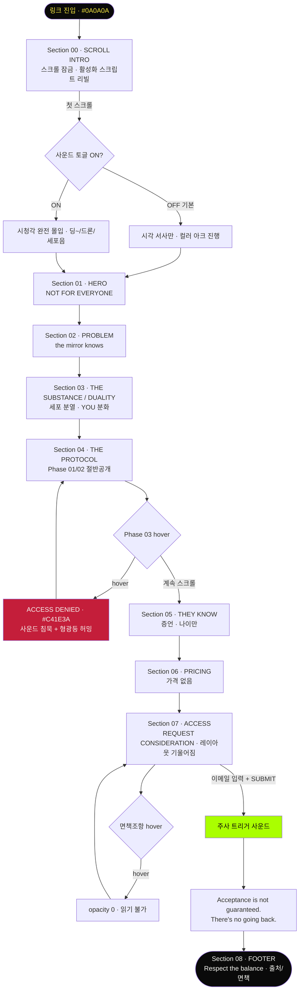

# THE SUBSTANCE — UX Flow

> 이 페이지는 **경험·서사 우선** 설계다. "마찰 최소화 → 빠른 전환"이라는 통상적 UX 목적을 그대로 따르지 않고, 영화적 시청각 경험을 웹으로 번역하는 것을 목적으로 둔다. 통상 UX 문법(명료한 CTA, 정보 제공, 부드러운 진행)은 버리는 것이 아니라 **서사에 맞게 취사선택하는 도구**다. 톤은 차갑고 단정하고 유혹적이되, 유저를 속이거나 방해하지 않는다 — 다만 편안하게 안심시키지도 않는다.

---

## 설계 원칙 — 경험을 지배하는 5가지 축

아래는 카피·비주얼·인터랙션 결정의 기준이 되는 서사적 축이다. UX 베스트프랙티스와 충돌할 때는 "무엇이 이 페이지의 경험을 더 살리는가"로 판단한다.

| # | 축 | 서사적 의도 | 화면에서의 표현 |
|---|------|------------|----------------|
| 1 | **정보 결핍** | 더 알고 싶게, 더 적게 준다 | 가격 없음, Phase 03 잠금 — 궁금증이 스크롤 동력 |
| 2 | **증거 없는 확신** | 검증 불가능성이 역설적 신뢰 | 증언에 이름·직업 없이 나이만 |
| 3 | **거절 불안** | 구매가 아니라 "지원" | "Request Consideration" · Acceptance is not guaranteed |
| 4 | **경고가 유혹** | 임상적 경고일수록 진짜 같다 | "Results vary. Irreversible."을 숨기지 않고 전면에 |
| 5 | **영구성** | 되돌릴 수 없음이 헌신을 만든다 | "There's no going back" 반복, 선형 여정 |

### 긴장감을 만드는 구체 장치 (과하지 않게, 서사에 봉사)

- **스크롤 리듬 제어**: 인트로에서 텍스트 리빌 속도를 페이지가 이끎(완전 잠금 아님 — 리듬 유도)
- **컬러 아크의 방향성**: 옐로→그린 전환은 스크롤 진행의 감정선. 되돌릴 때 약한 저항(히스테리시스)으로 "진행됐다"는 감각
- **사라지는 면책조항**: hover 시 페이드 — 읽히지 않으려는 텍스트라는 연출 (단, 키보드 focus로는 읽을 수 있게 접근성 보장)
- **잠긴 Phase 03**: hover 시 #C41E3A "ACCESS DENIED" — 거부가 갈망으로
- **침묵의 순간**: 사운드 ON 시 Phase 03 구간은 앰비언트가 끊기고 형광등 허밍만 — 정적의 긴장

---

## 유저 시나리오

### 시나리오 1: 첫 진입 — "발견"의 감각 (핵심 여정)

- **사용자**: 링크를 받고 처음 방문한 사람 (판매 페이지인지도 모름)
- **목표(표면)**: 이게 뭔지 알아내려 함
- **목표(실제, 페이지가 유도)**: 끝까지 스크롤하고 이메일을 남기게 됨
- **플로우**:
  1. #0A0A0A 검은 화면. ◗◗ 심볼만 희미하게. 아무 설명 없음
  2. 스크롤 시작 → 활성화 스크립트가 한 줄씩 아래에서 위로, blur→선명하게 stamp (POV 내부 시점)
  3. 배경에서 세포가 분열하고 노른자가 갈라짐. 처음엔 옐로, 스크롤할수록 그린으로 물듦
  4. "This is the Substance." → 딩~ (사운드 ON 시). "You. Are. One." → 딩~ 피치 다운 변형
  5. 텍스트가 사라지지 않고 쌓임 → 화면 과부하 → 압도당하는 감각 (의도적)
  6. 인트로 종료 → HERO "NOT FOR EVERYONE." / "You already know you're going to say yes."
- **성공 조건**: 유저가 "판매 페이지"라고 인지하기 전에 이미 서사에 몰입
- **예외 상황**: 사운드 기본 OFF → 시각만으로도 서사가 성립해야 함 (사운드는 증폭, 필수 정보 아님)

### 시나리오 2: 의심하다가 설득당함 — "The Skeptic"

- **사용자**: "이거 사기 아냐?" 의심하며 증거를 찾는 사람
- **목표**: 신뢰할 만한 근거(가격, 리뷰, 회사 정보)를 찾으려 함
- **플로우**:
  1. PROBLEM 섹션 — "You've done everything... And still, the mirror knows." → 자기 인식과 충돌
  2. HOW IT WORKS — Phase 01/02는 절반만 공개, Phase 03은 잠김 → 정보를 찾을수록 못 찾음
  3. THEY KNOW — 증언에 이름·직업 없이 나이만("— 51") → 검증하려다 실패 → 역설적으로 진짜 같음
  4. PRICING — 가격이 없음. "Investment discussed upon selection." → 통제권이 페이지에 있음을 자각
  5. 의심이 "혹시 진짜라면?"으로 전환 → ACCESS로 향함
- **성공 조건**: 증거의 **부재**가 오히려 확신으로 전환됨
- **예외 상황**: 유저가 이탈하면 그대로 이탈 — 붙잡는 팝업/할인 없음 (붙잡지 않는 것이 브랜드)

### 시나리오 3: 결심 — "Request Consideration"

- **사용자**: 이미 서사에 넘어간 사람. CTA에 도달
- **목표**: "지원"한다 (구매가 아님)
- **플로우**:
  1. ACCESS 섹션 — ◗◗ / "REQUEST CONSIDERATION" / 이메일 입력창 1개
  2. 레이아웃이 미세하게 기울어져 있음(대칭 붕괴) → 중심을 잃은 감각
  3. 이메일 입력 → "SUBMIT REQUEST" 클릭 → 주사 트리거 사운드(짧은 임팩트)
  4. "Acceptance is not guaranteed. There's no going back." → 제출했는데 확답 없음 → 불안 지속
  5. FOOTER — "You are one. Respect the balance." + 면책조항(hover 시 사라짐)
- **성공 조건**: 제출 = 안도가 아니라 **더 깊은 불안**으로 끝남 (거절 불안 유지)
- **예외 상황**: 제출은 실제 전송 없음(UI 시연). 성공 피드백조차 확답을 주지 않음 — "검토됩니다"가 아니라 "보장되지 않습니다"

### 시나리오 4: 소리를 켠 사람 — "Full Immersion"

- **사용자**: 우측 하단 사운드 토글을 ON 한 사람
- **목표**: 최대 몰입
- **플로우**:
  1. 토글 ON (사용자 제스처) → AudioContext resume → 40Hz 유기적 드론 시작
  2. 스크롤 깊이에 따라 앰비언트 진화: 초반(옐로) 느린 드론 → 후반(그린) 펄스 베이스 추가
  3. 세포 분열 순간마다 막 스트레칭→분열 임팩트→버블링 사운드가 애니메이션과 동기
  4. Substance 언급 텍스트마다 딩~ 시그니처
  5. Phase 03 구간 진입 → 모든 소리 페이드아웃, 형광등 허밍만 → 침묵의 불안
- **성공 조건**: 소리를 켠 순간 "완전히 다른 경험"이 됨 — 이것이 이 페이지 존재 이유의 핵심 검증
- **예외 상황**: 탭이 백그라운드로 가면 버블링 스케줄러 자동 정지(배터리). 재진입 시 복귀

---

## 스크롤 안무 (Scroll Choreography)

> 스크롤은 이 페이지의 유일한 입력이자 타임라인이다. 하나의 `scrollProgress`(0–1)가 **배경 3레이어 · 텍스트 리빌 · 컬러 아크 · 사운드**를 동시에 구동한다. 아래는 인트로 구간(Section 00)의 프레임별 안무.

### 인트로 타임라인 — 배경 × 텍스트 × 컬러 × 사운드 동기화

| 진행도 | 활성화 스크립트 (텍스트) | 배경 레이어 | 컬러 아크 | 사운드 (ON 시) |
|--------|------------------------|------------|----------|---------------|
| 0.00 | **◗◗ 로고만 (선명, 화면 중앙)** — 텍스트 없음 | 정지 (로고 단독) | 옐로 100% | (무음) 첫 스크롤 대기 |
| 0.03 | 로고 아래 "SCROLL" 미세 표시 | 노른자 원(#F5E642) 로고 뒤에서 서서히 등장 | 옐로 | 첫 스크롤 대기 |
| 0.05 | "Have you ever dreamt..." blur→선명, 아래→위 | 노른자 미세 진동 시작 | 옐로 | **딩~** (LAYER 5) + 드론 ON (LAYER 1, 40Hz) |
| 0.15 | "Younger. / More beautiful. / More perfect." 누적 stamp | 세포 파티클 등장(소수), 매크로 클로즈업 | 옐로 95% | 드론 지속, 저역 버블링 시작 |
| 0.30 | "One single injection unlocks your DNA..." | 노른자 **분열 시작**(YolkMorph) | 옐로→연두 전환 개시 | 막 스트레칭(LAYER 2) → 분열 임팩트(LAYER 3) |
| 0.40 | "This is the Substance." | 세포 분열 가속, 액체 출렁임 진해짐 | 연두 | **딩~** (텍스트 동시) + 버블링(LAYER 4) |
| 0.55 | "You are the matrix. / Everything is you." | 파티클 밀도 최대, 매크로→풀아웃 | 그린 70% | 드론 55Hz로 상승, 펄스 베이스 추가 |
| 0.70 | "You just have to share. / One week for one..." | 대칭 구도 유지 | 그린 | 버블링 지속 |
| 0.85 | "You. Are. One." | 화면 과부하(텍스트 누적) | 그린 90% | **딩~ 피치 다운 변형** (dematerialized) |
| 0.95 | "You can't escape from yourself." | 미세 대칭 붕괴 시작(skew) | 그린 100% | 드론 잔향, 인트로 종료 신호 |
| 1.00 | → HERO로 전환 | 배경 잔류(저투명), 이후 섹션 뒤에 은은히 | 그린 유지 | 앰비언트 계속(섹션별 진화) |

> **핵심 원칙 3가지**
> 1. **하나의 소스** — 별도 애니메이션 타이머 없이 `scrollProgress`에서 모든 값을 파생(배경 밀도, 텍스트 리빌, 컬러 lerp, 드론 주파수)
> 2. **누적, 비삭제** — 인트로 텍스트는 사라지지 않고 쌓임(의도적 과부하). "긴 숏" 기법의 번역
> 3. **되돌림 저항** — 위로 스크롤 시 컬러 아크·드론은 약한 히스테리시스로 즉시 복귀하지 않음(진행됐다는 감각)

### 섹션별 배경/모션 + 영화 기법 매핑

| 섹션 | 배경 상태 | 스크롤/등장 모션 | 영화 기법 번역 |
|------|----------|-----------------|---------------|
| 00 INTRO | 3레이어 풀가동 | 텍스트 순차 stamp | 매크로→풀아웃, POV 내부 등장 |
| 01 HERO | 저투명 잔류 | ◗◗ 작게→아이레벨로 확대 | 버즈아이→아이레벨, 미세 왜곡(perspective) |
| 02 PROBLEM | 어두워짐 | 라인별 페이드 인 | 롱렌즈 고립(주변 압축) |
| 03 SUBSTANCE/DUALITY | 세포·노른자 전면 복귀 | YOU 텍스트 분화(옐로/그린) | 대칭 미러링(◗◗ 구조), 매크로 |
| 04 PROTOCOL | 잔류, Phase03서 어두워짐 | Phase 카드 순차 등장 | 대칭 구도 유지 |
| 05 THEY KNOW | 거의 무배경(고립) | 증언 페이드 | 롱렌즈 고립 극대화 |
| 06 PRICING | 무배경 | 정적 | 침묵 |
| 07 ACCESS | 액체 미세 출렁임 | 레이아웃 미세 기울어짐 | 대칭 붕괴 |
| 08 FOOTER | 정지 | — | — |

### 과잉 조명 플래시 (특수 큐)

특정 순간 배경 #0A0A0A에서 텍스트 주변이 #F5F5F0으로 폭발하듯 밝아졌다 복귀(CSS filter brightness). 트리거: "This is the Substance." / "You. Are. One." / SUBMIT 클릭 직후. "숨을 곳 없는 임상적 과잉 조명"의 번역 — 남발 금지, 3~4회만.

---

## 인터랙션 → 사운드 매핑

> 모든 사운드는 Web Audio API 실시간 합성(오디오 파일 없음). 5레이어 구조. 아래는 **어떤 사건이 어떤 레이어를 트리거하는가**의 계약(contract) — 구현 시 이 표가 오디오 엔진 사양의 입력이 된다.

### 사운드 레이어 (5종)

| 레이어 | 이름 | 성격 | 지속 |
|--------|------|------|------|
| L1 | 베이스 드론 | 40→55Hz 유기적 저음, 페이지가 살아있는 느낌 | 상시(스크롤 연동) |
| L2 | 세포막 스트레칭 | 밴드패스 노이즈 상승, 끈적한 늘어남 | 분열 직전 1.5s |
| L3 | 분열 임팩트 | 저역 텀프 + 습한 노이즈 버스트 | 순간(~0.15s) |
| L4 | 액체 버블링 | 랜덤 간격 점성 버블 | 분열 후 일정 시간 |
| L5 | 딩~ 시그니처 | 880Hz + 배음, 금속·임상 | 2.5s 페이드 |

### 이벤트 → 트리거 계약

| 인터랙션 / 이벤트 | 트리거 사운드 | 타이밍 | 비고 |
|-------------------|--------------|--------|------|
| 페이지 첫 진입(제스처 후) | L5 딩~ | 0.5s 지연 | AudioContext resume 필요 |
| 첫 스크롤 | L1 드론 ON | 즉시 | 이후 스크롤 깊이로 주파수 상승 |
| 세포 스트레칭 시작 | L2 막 스트레칭 | 애니메이션 동기 | Canvas 이벤트 연동 |
| 세포 분열 순간 | L3 분열 임팩트 | 분열 프레임 정각 | 시각과 프레임 일치 필수 |
| 분열 직후 | L4 버블링 시작 | +0.1s | 일정 시간 후 자동 종료 |
| "This is the Substance" 등장 | L5 딩~ | 텍스트 동시 | |
| "You. Are. One." 등장 | L5 딩~ + 피치 다운 | 텍스트 동시 | dematerialized voice 번역 |
| 스크롤 후반(그린 구간) 진입 | L1 + 펄스 베이스 | 점진 | 수(Sue)의 합성적 사운드 |
| 로고 ◗◗ hover | 미세 금속 틱(L5 축소판) | 즉시 | 선택적 — 과하면 생략 |
| 키워드 hover (SUBSTANCE/ONE/YOU) | 짧은 딩~ 하모닉 | 즉시 | glow와 동기 |
| **Phase 03 hover** | **전체 앰비언트 페이드아웃 + 형광등 허밍(60Hz)** | 즉시 | 침묵의 건축 — 가장 중요한 사운드 연출 |
| Phase 03 hover 해제 | 앰비언트 복귀 | 0.3s ramp | |
| CTA hover | 미세 충전음(상승 톤) | 즉시 | 반전 애니메이션과 동기 |
| **SUBMIT REQUEST 클릭** | **주사 트리거(짧은 클릭+임팩트)** | 즉시 | 일상음 재맥락화 — UI음 아닌 임상 장비음 |
| 사운드 토글 OFF | 마스터 게인 0.1s fade | — | 즉시 끊으면 클릭 노이즈 |
| 탭 백그라운드 전환 | 버블링 스케줄러 정지 | visibilitychange | 배터리 |

> **사운드 설계 철학**(영화 기법 번역): UI 소리를 쓰지 않는다. 버튼은 "클릭"이 아니라 주사 트리거처럼, 앰비언트는 배경음악이 아니라 내장 소리처럼 들린다. 소리는 장식이 아니라 **경험의 절반** — 토글 OFF일 때도 서사는 성립하되, ON일 때 완전히 다른 밀도가 되어야 한다(성공 기준 최우선 항목).

---

## UX 플로우



> **핵심**: 이 플로우에는 "뒤로 가기"·"다른 경로"·"건너뛰기"가 없다. 단 하나의 선형 여정 — 불가역성(Irreversibility)의 구조적 반영. 유일한 분기는 사운드 ON/OFF와 hover 인터랙션(잠금/사라짐)뿐이며, 이들은 되돌아와도 유저를 같은 자리에 놓는다.

---

## 정보 구조 (IA)

```
THE SUBSTANCE (single-page · 선형)
│
├── Section 00 — SCROLL INTRO (full-bleed, 스크롤 잠금)
│   ├── ◗◗ 로고 (최초 진입 화면 · 선명 · 중앙 · 텍스트 없음 → 시작점)
│   ├── 활성화 스크립트 (순차 리빌, 15+ 라인)
│   └── 배경 레이어 3종 (세포 분열 / 노른자 모핑 / 형광 액체)
│
├── Section 01 — HERO (center column, max 680px)
│   ├── ◗◗
│   ├── NOT FOR EVERYONE.
│   └── You already know you're going to say yes.
│
├── Section 02 — PROBLEM
│   └── "the mirror knows / the camera knows / the room knows" → Until now.
│
├── Section 03 — THE SUBSTANCE / THE DUALITY
│   ├── You are the matrix / Everything is you
│   ├── [세포 분열 애니메이션 · #AAFF00]
│   ├── DUALITY 시퀀스 (STAGE A/B/C — YOU 텍스트 분화)
│   └── DNA CELLULAR REPLICATION PROTOCOL · Est. ————
│
├── Section 04 — THE PROTOCOL
│   ├── PHASE 01 — ACTIVATION (전문 공개, Irreversible)
│   ├── PHASE 02 — STABILIZATION (절반 공개, ——— 처리)
│   └── PHASE 03 — CONTINUATION [LOCKED] (전체 잠김, hover: ACCESS DENIED)
│
├── Section 05 — THEY KNOW (롱렌즈 고립)
│   └── 증언 4개 (이름·직업 없음, 나이만: 51 / 47 / 44 / 53)
│
├── Section 06 — PRICING
│   └── 가격 없음 · Investment discussed upon selection · Acceptance is not guaranteed
│
├── Section 07 — ACCESS (레이아웃 미세 기울어짐)
│   ├── ◗◗
│   ├── REQUEST CONSIDERATION
│   ├── [이메일 입력 1개]
│   ├── SUBMIT REQUEST
│   └── Acceptance is not guaranteed. There's no going back.
│
├── Section 08 — FOOTER
│   ├── Results vary / What has been transferred won't come back / Respect the balance
│   ├── youonlybetter.com
│   ├── Inspired by The Substance (2024), dir. Coralie Fargeat
│   └── [면책조항 전문 — hover 시 사라짐]
│
└── [Fixed] 사운드 토글 (우측 하단, 기본 OFF)
```

> 브리프의 6섹션 구조에 PROBLEM·DUALITY·PRICING을 추가 반영해 총 **8섹션 + 인트로**로 구성. HERO→THE SUBSTANCE 사이 PROBLEM, THE SUBSTANCE 내부에 DUALITY 시퀀스, THEY KNOW 뒤 PRICING을 배치 (youonlybetter.com 콘텐츠 기준).

---

## 데이터 모델 (프론트엔드 상태 중심)

이 페이지는 백엔드가 없다. 모든 "데이터"는 스크롤·인터랙션에 반응하는 클라이언트 상태다.

| 엔티티 | 주요 필드 | 관계 / 비고 |
|--------|----------|------------|
| **ScrollState** | `scrollProgress` (0–1), `activeLine` (인트로 라인 인덱스), `currentSection` | 전역. 아래 모든 상태의 트리거 소스 |
| **ColorArc** | `arcValue` (0=옐로 #F5E642 → 1=그린 #AAFF00), `hysteresis` (되돌림 저항) | `scrollProgress` 파생. 위로 스크롤해도 완전 복귀 안 함(불가역) |
| **AudioState** | `isEnabled` (기본 false), `masterGain`, `activeLayers[]` (drone/stretch/split/bubble/ding), `contextResumed` | 사용자 제스처 후에만 활성. `ScrollState`·애니메이션 이벤트에 반응 |
| **CellSystem** | `particles[]` (position, phase, splitProgress), `divisionEvents[]` | Canvas. 분열 이벤트가 AudioState LAYER 3 트리거 |
| **ActivationScript** | `lines[]` (text, revealState: hidden/revealing/stamped), `dingTriggers[]` | 인트로 텍스트. 특정 라인이 딩~ 발생 |
| **ProtocolPhase** | `id` (01/02/03), `disclosure` (full/half/locked), `isLocked`, `hoverState` | Phase 03만 locked. hover 시 ACCESS DENIED |
| **RequestForm** | `email`, `submitState` (idle/submitting/submitted), `isGuaranteed: false` | 실제 전송 없음. 제출해도 확답 주지 않음 |
| **DisclaimerState** | `isRevealed` (hover 시 false로), `text` | hover하면 사라지는 역설적 상태 |
| **CinematicCue** | `type` (macro-pullout/symmetry-break/overbright-flash/lens-isolation), `sectionTrigger` | 영화 기법 번역. 섹션별 트리거 |

> 데이터라기보다 **감각 상태 머신** — 스크롤이라는 단일 입력이 컬러·사운드·모션·텍스트를 동시에 구동한다.

---

## 컴포넌트 리스트

기존 디자인 시스템 재활용 우선. `재활용` / `수정` / `신규` 3단계.

### 재활용 — 그대로 사용

| 컴포넌트 | 용도 | 구분 | 기존 경로 |
|----------|------|------|----------|
| ScrollRevealText | 인트로 활성화 스크립트 순차 리빌 | 재활용 | `kinetic-typography/ScrollRevealText.jsx` |
| SectionContainer | 6~8개 섹션 컨테이너 | 재활용 | `container/SectionContainer.jsx` |
| PageContainer | 센터 컬럼 max-width 680px | 재활용 | `layout/PageContainer.jsx` |
| FullPageContainer | 인트로 풀뷰포트 | 재활용 | `layout/FullPageContainer.jsx` |
| QuotedContainer | THEY KNOW 증언 인용 | 재활용 | `typography/QuotedContainer.jsx` |
| StretchedHeadline | HERO/챕터 대형 타이포 | 재활용 | `typography/StretchedHeadline.jsx` |
| TextField [MUI] | ACCESS 이메일 입력 | 재활용 | MUI |

### 수정 — props 추가/스타일 오버라이드 필요

| 컴포넌트 | 용도 | 구분 | 필요 변경 |
|----------|------|------|----------|
| FadeTransition | POV 내부 텍스트 등장 (blur→선명, 아래→위) | 수정 | blur 초기값 + 방향 상향 옵션 |
| PerspectiveTransition | HERO 미세 왜곡 · 대칭 붕괴 | 수정 | 미세 skew/rotate 값, 스크롤 연동 강도 |
| ScrollScaleContainer | 매크로→풀아웃 (글자획/세포 확대 후 축소) | 수정 | 극단 scale 범위(예: 8x→1x) |
| GradientOverlayDynamic | 형광 액체 출렁임 배경 | 수정 | 팔레트를 옐로→그린 아크로, 스크롤 연동 |
| Button [MUI] | CTA hover 반전 (#AAFF00 채움 + 텍스트 #0A0A0A) | 수정 | sx hover 오버라이드, ALL CAPS |
| Switch [MUI] | 사운드 토글 (우측 하단 고정) | 수정 | 커스텀 라벨/아이콘, fixed 포지션 |
| HighlightedTypography | 키워드(SUBSTANCE/ONE/YOU) pulse glow | 수정 | #AAFF00 glow hover 애니메이션 |

### 신규 — 새로 제작

| 컴포넌트 | 용도 | 구분 | 배치 카테고리 |
|----------|------|------|--------------|
| SubstanceLogo | ◗◗ 심볼 + hover 시 두 반원 분리 애니메이션 | 신규 | `common/ui/` (범용 아이덴티티) |
| CellDivisionCanvas | Canvas 세포 분열 파티클 (#AAFF00) | 신규 | `scroll/` 또는 `media/` |
| YolkMorph | SVG 계란 노른자 옐로 원 → 둘로 분열 | 신규 | `motion/` |
| DualitySequence | STAGE A/B/C — YOU 텍스트 분화 (옐로/그린) | 신규 | `kinetic-typography/` |
| LockedPhase | Phase 03 잠금 + hover ACCESS DENIED (#C41E3A) | 신규 | `overlay-feedback/` 또는 `card/` |
| VanishingDisclaimer | hover 시 opacity 0 면책조항 | 신규 | `typography/` |
| RequestConsideration | ACCESS 폼 래퍼 (이메일 + 확답없는 제출) | 신규 | `templates/` |
| ProtocolPhaseCard | Phase 01/02/03 공개도(full/half/locked) 카드 | 신규 | `card/` |

### 훅 / 유틸 (컴포넌트 외)

| 이름 | 용도 | 배치 |
|------|------|------|
| useSubstanceAudio | Web Audio 5레이어 합성 엔진 (드론/스트레치/분열/버블/딩) | `utils/` 또는 컴포넌트 폴더 훅 |
| useColorArc | 스크롤→컬러 아크(옐로→그린, 히스테리시스) | 훅 |
| useScrollLock | 인트로 스크롤 잠금/리듬 제어 | 훅 |
| useCinematicCue | 영화 기법 트리거(매크로/대칭붕괴/과잉조명 플래시) | 훅 |

> **재활용률**: 인트로 텍스트 리빌·섹션 구조·모션 전환은 기존 컴포넌트로 상당 부분 커버. 신규는 대부분 "영화 고유의 유기적 비주얼"(세포/노른자/액체/로고 분리)과 "서사 장치"(잠금/사라짐/확답없는 폼)에 집중됨 — 이 프로젝트의 차별점이 정확히 신규 컴포넌트와 사운드 엔진에 몰려 있음.

---

## 반응형 / 접근성 노트

- **모바일**: 스크롤 잠금은 터치 환경에서 완화(잠금보다 스냅). Canvas 파티클 수 감소, 사운드 버블링은 백그라운드 시 정지
- **prefers-reduced-motion**: 세포 분열·모핑·과잉조명 플래시 축소, 텍스트 리빌은 페이드로 대체 (서사는 유지)
- **사운드**: 기본 OFF, 명시적 토글 필요(자동재생 금지). 시각만으로 전체 서사 성립
- **면책조항**: hover로 사라지지만, 접근성을 위해 focus/키보드로는 읽을 수 있게 유지(법적 고지 최소 보장)
