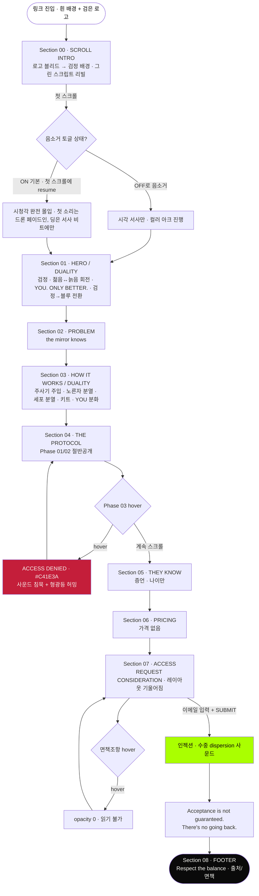

# THE SUBSTANCE — UX Flow

> ✅ **구현 현황 (2026-07-21) — 문서 vs 실제 빌드 정합**
> 이 문서의 나머지는 원안(기획 의도)이며 아직 다수 미구현이다. 아래는 **현재 앱(`App.jsx`)에 실제로 빌드된 것**과 원안이 갈라진 지점의 요약 — 충돌 시 이 블록이 최신이다.
>
> **1. 단일 sticky 씬 아키텍처 (중요).** 인트로 → 전환 → HOW IT WORKS → THE PROTOCOL 전 구간을 **하나의 sticky 뷰포트**(`sceneRef`, `SCENE_VH`)에서 진행한다. 진행도(`sceneProgress`)를 `introPhase`/`handoffPhase`/`worksP`/`protoP`로 분할. **별도 sticky 섹션으로 나누지 않는다** — 섹션 사이에 1화면 죽은 공백(seam)이 생겨서(인트로↔HOW IT WORKS, HOW IT WORKS↔PROTOCOL에서 반복 발생) 전부 병합함.
>
> **2. 인트로(IntroLogoBleed).** 흰→검정 로고 블리드 → 그린 스크립트 순차 stamp(HAVE YOU EVER DREAMT / …BETTER VERSION / [립스월 3연] / ONE SINGLE INJECTION[잉크확산 영상 비트] / THIS IS THE SUBSTANCE[딩]). 립스 비트 구간·인젝션 영상 비트 존재. GNB ◗◗ 로고는 배경색 따라 흰↔검정 적응.
>
> **3. 인트로 → HOW IT WORKS 전환.** 마지막 "THIS IS THE SUBSTANCE"가 **제자리에서 gooey로 녹으며 초록→파랑**으로 물들고, 그 파란 글자가 **팽창(dilate)해 잉크처럼 번져 배경 자체가 됨**(별도 원/커튼 아님 — 유저가 원형 확산·배수·디졸브안 거부). 배경색은 검정→블루로 수렴.
>
> **4. HOW IT WORKS(SubstanceHowItWorks).** 리빌 순서 = **노른자 등장 → (pause) → 헤더 텍스트 순차(eyebrow→title→body) → 프로그레스바(마지막)**. 메커닉: 좌 주사기 배출(주입)이 **완전히 끝난 뒤** 노른자 부글부글 → 분열(싱크 맞춤). 프로그레스바 끝=완전 둥근 pill. SFX 3종(노른자 등장=squishy, 주입 시작=big-bubble 1회, 분열=split, 윈도우 원샷).
>
> **5. HOW IT WORKS(블루) → THE PROTOCOL(검정) 전환.** **WebGL 리퀴드 마블**(`SubstanceLiquidWipe`, fBm 도메인워핑) — 평평한 블루가 액체로 살아나 블루↔블랙 흐르다 전체 블랙 수렴(포스터 액체/수중 dispersion 모티프).
>
> **6. THE PROTOCOL.** 상단 흰색 "THE PROTOCOL" 타이틀. Phase 01 ACTIVATION(ACTIVATOR 필름 뜯기 스크럽) → Phase 02 STABILIZATION(**FOOD MATRIX + FOOD OTHER SELF 두 파우치**, 위→아래 소진, `frameSnap` 하드컷) → Phase 03 CONTINUATION(**SWITCH** 투명 코일에 그린 액체 주입, 양끝 오프스크린·배경 투명·글로우 없음, `frameSnap`). 상세는 아래 "PHASE 키트" 표 참조.
>
> **7. 사운드.** 자동재생 정책 회피 위해 **muted `<video>`(mp4)** 로 pulse/youth/injection/ding 재생 후 첫 제스처에 언뮤트. works SFX는 `new Audio()` 원샷. 우하단 커스텀 세로 pill 토글(배경따라 색 적응).
>
> **8. 카피.** Phase 카피는 4원칙(꿈 공개·대가 은닉, 유혹적/궁금, 비위협)에 맞춰 리라이트됨 — 아래 "Phase 카피" 표 참조.
>
> **미구현(원안 유지):** HERO/DUALITY, THEY KNOW(증언), ACCESS(폼), FOOTER, 컬러아크 훅, 사운드 엔진 전체 설계. (Phase 03 SWITCH는 구현 완료)

---

> 이 페이지는 **경험·서사 우선** 설계다. "마찰 최소화 → 빠른 전환"이라는 통상적 UX 목적을 그대로 따르지 않고, 영화적 시청각 경험을 웹으로 번역하는 것을 목적으로 둔다. 통상 UX 문법(명료한 CTA, 정보 제공, 부드러운 진행)은 버리는 것이 아니라 **서사에 맞게 취사선택하는 도구**다. 톤은 차갑고 단정하고 유혹적이되, 유저를 속이거나 방해하지 않는다 — 다만 편안하게 안심시키지도 않는다.

---

## 설계 원칙 — 경험을 지배하는 5가지 축

아래는 카피·비주얼·인터랙션 결정의 기준이 되는 서사적 축이다. UX 베스트프랙티스와 충돌할 때는 "무엇이 이 페이지의 경험을 더 살리는가"로 판단한다.

| # | 축 | 서사적 의도 | 화면에서의 표현 |
|---|------|------------|----------------|
| 1 | **정보 결핍** | 더 알고 싶게, 더 적게 준다 | 가격 없음, Phase 03 잠금 — 궁금증이 스크롤 동력 |
| 2 | **증거 없는 확신** | 검증 불가능성이 역설적 신뢰 | 증언에 이름·직업 없이 나이만 |
| 3 | **거절 불안** | 구매가 아니라 "지원" | "Request Consideration" · Acceptance is not guaranteed |
| 4 | **경고가 유혹** | 임상적 경고일수록 진짜 같다 | "Results vary. Irreversible."을 숨기지 않고 전면에 |
| 5 | **영구성** | 되돌릴 수 없음이 헌신을 만든다 | 전면은 **"Forever."**(영원한 젊음=보상). "There's no going back"은 상실 뉘앙스라 **제출 이후에만**, 선형 여정 |

### 긴장감을 만드는 구체 장치 (과하지 않게, 서사에 봉사)

- **스크롤 리듬 제어**: 인트로에서 텍스트 리빌 속도를 페이지가 이끎(완전 잠금 아님 — 리듬 유도). 인트로는 **영화처럼 빠른 페이싱** — 각 스크립트가 배경음과 함께 속도감 있게 지나감(느긋한 리빌 아님)
- **로고 블리드(인트로 오프닝)**: **흰 배경** 위 **검은 ◗◗ 로고**로 시작 → 스크롤하면 로고의 검정이 원형으로 배경 전체에 번져 `#0A0A0A`로 전환. 어둠이 로고에서 태어나 화면을 삼키는 감각. 배경이 검어진 뒤 각 활성화 스크립트는 **형광 그린**(secondary.main)으로 stamp
- **컬러 아크의 방향성**: 옐로→그린 전환은 스크롤 진행의 감정선(주로 **HOW IT WORKS의 노른자**와 전체 액센트에 적용). 되돌릴 때 약한 저항(히스테리시스)으로 "진행됐다"는 감각. ※ 인트로 자체는 흰→검 블리드 + 그린 텍스트의 모노 팔레트(옐로 아님)
- **사라지는 면책조항**: hover 시 페이드 — 읽히지 않으려는 텍스트라는 연출 (단, 키보드 focus로는 읽을 수 있게 접근성 보장)
- **Phase 03(CONTINUATION)**: 티저 카피를 블러 위에 노출해 궁금증 유발 — 겁주지 않고 "자동 지속 + 종료 결정은 유저"로 통제권을 남김 (※ 초기안의 hover "ACCESS DENIED" 박스는 제거됨)
- **침묵의 순간**: 사운드 ON 시 Phase 03 구간은 앰비언트가 끊기고 형광등 허밍만 — 정적의 긴장

---

## 카피 전략 — "꿈은 공개, 대가는 은닉" (Copy Strategy)

> 사운드와 동일한 "욕망의 UX" 원리가 카피에도 적용된다. **good UX(명료·안심)가 아니라 욕망의 UX** — 유저가 유혹당하는 줄 모르게 스스로 욕망을 발견하고, 어두운 대가는 영화처럼 **너무 늦게** 알게 된다.

### 판정 기준 — 유혹적 두려움 vs 반발적 위협

같은 "무서운 카피"라도 갈린다. 경계는 하나: **카피가 유저를 공격하는가, 유혹하는가.**

| | 유혹적 두려움 (사용) | 반발적 위협 (금지) |
|---|---|---|
| 대상 | 유저가 **욕망의 주체** | 유저가 **공격의 대상** |
| 방식 | 유보·암시·거울·초대 | 위협·수치·부담·구체적 대가 폭로 |
| 이성의 반응 | 반박할 구체물 없음 → 각성 지속 | 반박할 구체물 제공 → 냉정·이탈 |

### 4대 카피 원칙 (모든 문구 결정 기준)

1. **꿈은 아낌없이 공개, 대가는 은닉** — 영화 속 인물은 조인 전까지 불가역성을 모른다(무지가 함정). 조인 전 랜딩은 **순수한 욕망 충족**처럼 느껴져야 함. 어두운 대가는 조인 후/fine-print로 미룬다.
2. **경고는 임상적·모호하게만** — "Results vary. Irreversible."(모호=유혹) OK / **구체적 상실 폭로 금지**("what has been transferred won't come back" = 경보 = 도망).
3. **불가역성 = 경고 아닌 보상** — "no going back"(상실) 대신 **"Forever."**(영원한 젊음=선물)을 전면에. 상실 뉘앙스는 제출 이후에만.
4. **유혹을 선언하지 않는다** — "you'll say yes"처럼 못박으면 반발. 유저가 **자기 욕망을 스스로 발견**하게("You've already imagined it.").

### 순서 원칙 (Sequencing) — 개별 문구보다 중요

dread는 **욕망이 먼저 형성된 뒤에만** "진짜구나"로 읽힌다. 욕망 대상(Younger/More perfect)보다 dread(mirror knows)가 먼저 오면 그냥 무섭다. → **판타지로 먼저 유혹 → 그다음 임상적 dread.** (인트로가 "Younger…"를 dread보다 앞세운 것은 정확.)

### 카피 판정 결과 (유지 / 리프레임 / 제거)

| 카피 | 판정 | 이유 |
|------|------|------|
| the mirror / camera / room knows | ✅ 유지 | 제품 위협이 아니라 유저가 **이미 아는 고통의 명명** = 간파당함 = 자석 |
| NOT FOR EVERYONE | ✅ 유지 | 금지·배제(reactance). 막힐수록 원함 |
| Acceptance is not guaranteed | ✅ 유지 | 거절 불안·희소. 못 가질수록 원함 |
| Investment discussed upon selection (가격 없음) | ✅ 유지 | 가격 = 1순위 이탈 트리거. 은닉이 판타지 유지 |
| 증언 나이만(51/47/44/53) | ✅ 유지 | 검증 불가 = 반박 불가(역설적 신뢰) |
| Younger. More beautiful. More perfect. | ✅ 유지(필수) | 거의 유일한 순수 욕망-대상. 없으면 dread만 남아 무섭기만 함 |
| Results vary. Irreversible. | ✅ 유지 | 단 **임상적·작게**. 헤드라인화 금지 |
| **There's no going back** | 🔧 리프레임 | 전면은 **"Forever."**(보상). 상실 뉘앙스는 **제출 이후**에만 |
| **What has been transferred won't come back** | ❌ 제거 | 구체적 상실 폭로 = 경보. 전면 삭제, 사라지는 면책조항 fine-print로만 |
| **You already know you're going to say yes** | 🔧 리프레임 | 유혹 선언 = 반발. → **"You've already imagined it."**(유저 자신의 욕망을 가리킴) |

---

## 유저 시나리오

### 시나리오 1: 첫 진입 — "발견"의 감각 (핵심 여정)

- **사용자**: 링크를 받고 처음 방문한 사람 (판매 페이지인지도 모름)
- **목표(표면)**: 이게 뭔지 알아내려 함
- **목표(실제, 페이지가 유도)**: 끝까지 스크롤하고 이메일을 남기게 됨
- **플로우**:
  1. **흰 배경** + **검은 ◗◗ 로고**만 중앙에. 아무 설명 없음
  2. 스크롤 시작 → 로고의 **검정이 원형으로 배경 전체에 번져** `#0A0A0A`로 전환(로고 블리드)
  3. 배경이 검어진 뒤, 활성화 스크립트가 **형광 그린**으로 한 줄씩 **빠르게**(영화식 페이싱) stamp — 각 라인에 배경음 stinger 동기. ※ 인트로엔 노른자·세포 없음(그건 HOW IT WORKS 전용) — 인트로는 서비스 인트로/긴장 조성
  4. "This is the Substance." → 딩~ (사운드 ON 시). "You. Are. One." → 딩~ 피치 다운 변형
  5. 텍스트는 **한 번에 한 줄만** — 올라와 선명해졌다 위로 빠지며 다음 줄로 교체(빠른 페이싱, 한 문장씩 집중)
  6. **블리드 완료 시점에 흰색 소형 ◗◗ 로고가 GNB 좌측 상단에 등장** → 이후 모든 섹션에서 상시 노출(서비스 페이지 아이덴티티)
  7. 인트로 종료 → HERO "NOT FOR EVERYONE." / "You've already imagined it." (유혹을 선언하지 않고 유저 자신의 욕망을 가리킴)
- **성공 조건**: 유저가 "판매 페이지"라고 인지하기 전에 이미 서사에 몰입
- **예외 상황**: 사운드 기본 ON이되 첫 제스처(스크롤) 전엔 무음(autoplay 정책 준수) → 시각만으로도 서사가 성립해야 함 (사운드는 증폭, 필수 정보 아님)

### 시나리오 2: 의심하다가 설득당함 — "The Skeptic"

- **사용자**: "이거 사기 아냐?" 의심하며 증거를 찾는 사람
- **목표**: 신뢰할 만한 근거(가격, 리뷰, 회사 정보)를 찾으려 함
- **플로우**:
  1. PROBLEM 섹션 — "You've done everything... And still, the mirror knows." → 자기 인식과 충돌
  2. HOW IT WORKS — Phase 01/02는 절반만 공개, Phase 03은 잠김 → 정보를 찾을수록 못 찾음
  3. THEY KNOW — 증언에 이름·직업 없이 나이만("— 51") → 검증하려다 실패 → 역설적으로 진짜 같음
  4. PRICING — 가격이 없음. "Investment discussed upon selection." → 통제권이 페이지에 있음을 자각
  5. 의심이 "혹시 진짜라면?"으로 전환 → ACCESS로 향함
- **성공 조건**: 증거의 **부재**가 오히려 확신으로 전환됨
- **예외 상황**: 유저가 이탈하면 그대로 이탈 — 붙잡는 팝업/할인 없음 (붙잡지 않는 것이 브랜드)

### 시나리오 3: 결심 — "Request Consideration"

- **사용자**: 이미 서사에 넘어간 사람. CTA에 도달
- **목표**: "지원"한다 (구매가 아님)
- **플로우**:
  1. ACCESS 섹션 — ◗◗ / "REQUEST CONSIDERATION" / 이메일 입력창 1개
  2. 레이아웃이 미세하게 기울어져 있음(대칭 붕괴) → 중심을 잃은 감각
  3. 이메일 입력 → "SUBMIT REQUEST" 클릭 → 인젝션 사운드(수중 dispersion — 주사액이 물에 퍼지는 먹먹한 소리)
  4. "Acceptance is not guaranteed. There's no going back." → 제출했는데 확답 없음 → 불안 지속
  5. FOOTER — "You are one. Respect the balance." + 면책조항(hover 시 사라짐)
- **성공 조건**: 제출 = 안도가 아니라 **더 깊은 불안**으로 끝남 (거절 불안 유지)
- **예외 상황**: 제출은 실제 전송 없음(UI 시연). 성공 피드백조차 확답을 주지 않음 — "검토됩니다"가 아니라 "보장되지 않습니다"

### 시나리오 4: 소리를 켠 사람 — "Full Immersion"

- **사용자**: 기본 ON 상태로 들어와 음소거하지 않은 사람 (대다수 유저)
- **목표**: 최대 몰입
- **플로우**:
  1. 진입 시 토글은 시각적으로 ON → **첫 스크롤(유효한 제스처)에서 AudioContext resume** → 40Hz 유기적 드론 페이드인 (첫 소리는 딩이 아니라 드론). 유저 체감상 "OFF였다가 켠" 감각 없이 소리가 살아남
  2. 스크롤 깊이에 따라 앰비언트 진화: 초반(옐로) 느린 드론 → 후반(그린) 펄스 베이스 추가
  3. 세포 분열 순간마다 막 스트레칭→분열 임팩트→버블링 사운드가 애니메이션과 동기
  4. Substance 언급 텍스트마다 딩~ 시그니처
  5. Phase 03 구간 진입 → 모든 소리 페이드아웃, 형광등 허밍만 → 침묵의 불안
- **성공 조건**: 소리를 켠 순간 "완전히 다른 경험"이 됨 — 이것이 이 페이지 존재 이유의 핵심 검증
- **예외 상황**: 탭이 백그라운드로 가면 버블링 스케줄러 자동 정지(배터리). 재진입 시 복귀

---

## 스크롤 안무 (Scroll Choreography)

> 스크롤은 이 페이지의 유일한 입력이자 타임라인이다. 하나의 `scrollProgress`(0–1)가 **배경 3레이어 · 텍스트 리빌 · 컬러 아크 · 사운드**를 동시에 구동한다. 아래는 인트로 구간(Section 00)의 프레임별 안무.

### 인트로 타임라인 — 로고 블리드 × 그린 스크립트 × 사운드 동기화

> 인트로엔 노른자·세포가 없다. 오프닝은 **흰 배경 + 검은 로고**, 스크롤하면 로고의 검정이 배경으로 번져 어두워지고(블리드), 그 위에 활성화 스크립트가 **형광 그린**으로 빠르게 stamp된다. 페이싱은 영화처럼 속도감 있게.
>
> **인트로 배경음 레퍼런스(조사)**: 영화 오프닝(할리우드 워크오브페임 스타 타임랩스)에는 작곡가 **Raffertie**의 타이틀 트랙 **"The Substance"** — 어둡고 테크노풍의, 필터링된 저역이 맥동하는 불안한 톤 — 이 깔린다. 저작권상 원곡을 웹에 쓸 수 없으므로 **L1 베이스 드론(합성)으로 그 무드(저역 펄스·불안)만 번역**한다. 각 스크립트 라인엔 짧은 stinger를 얹어 영화식 속도감을 만든다.

> **욕망 3연**("Younger./More beautiful./More perfect.")은 아래 **0.20~0.28 구간의 립스→TV월 멀티플라이 비트**로 처리한다(개별 stamp, 별도 안무 표 참조).

| 진행도 | 활성화 스크립트 (텍스트, 그린) | 로고 블리드 / 배경 | 사운드 (ON 시) |
|--------|------------------------------|-------------------|---------------|
| 0.00 | (텍스트 없음) | **흰 배경 + 검은 ◗◗ 로고**, 화면 중앙 선명 | (무음) 첫 스크롤 대기 |
| 0.03 | 로고 아래 "SCROLL" 미세 표시(검정) | 흰 배경 유지 | 첫 스크롤 대기 |
| 0.06 | "Have you ever dreamt…" blur→선명, 빠르게 | **블리드 개시** — 로고 검정이 원형으로 번지기 시작 | **드론 페이드인** (L1, 40Hz) — 딩 없음 |
| 0.13 | "…a better version of yourself?" (태그라인 연속) | 검정 원 확산(화면 ~60%) | 드론 지속, 저역 텐션 상승 |
| 0.17 | (전환) | **블리드 완료 = 배경 #0A0A0A** → **흰색 소형 ◗◗ 로고 GNB 좌상단 등장(이후 상시)** | 드론 |
| 0.20 | **"Younger."** | **단일 립스 클로즈업**(웜핑크, 검은 배경 위) — `9e32…jpg` | stinger 1 |
| 0.24 | **"More beautiful."** | 립스 **2×2~3×3 멀티플라이** 시작 | stinger 2 (피치↑) |
| 0.28 | **"More perfect."** | **풀 CRT TV 월** + 글로우·스캔라인 — `4aa6ec…jpg` | stinger 3 + 미세 딩 |
| 0.34 | "One single injection unlocks your DNA…" | TV 월 페이드아웃 → 검은 배경, 그린 텍스트 | 라인 stinger |
| 0.42 | "This is the Substance." | 검은 배경(#0A0A0A) | **딩~** (텍스트 동시) + 과잉조명 플래시 |
| 0.58 | "You are the matrix. / Everything is you." (한 비트, 2줄) | 검은 배경, 그린 텍스트 교체 | 드론 55Hz 상승, 펄스 베이스 |
| 0.74 | "You just have to share. / One week for one." (한 비트, 2줄) | 검은 배경 | 라인 stinger |
| 0.90 | "You. Are. One." | 미세 대칭 붕괴 시작(skew) | **딩~ 피치 다운 변형** (dematerialized), 인트로 종료 신호 |
| 1.00 | → HERO로 전환 | 검은 배경 유지 | 앰비언트 계속(섹션별 진화) |

> 라인은 한 번에 한 **비트**만 노출(교체). 한 비트가 여러 줄(예: "You are the matrix. / Everything is you.")이어도 됨. 마지막 "You can't escape from yourself."는 제거.

> **핵심 원칙 3가지**
> 1. **하나의 소스** — 별도 애니메이션 타이머 없이 `scrollProgress`에서 모든 값을 파생(블리드 반경, 텍스트 리빌, 드론 주파수)
> 2. **한 번에 한 줄(교체)** — 인트로 텍스트는 쌓지 않는다. 한 라인이 아래에서 올라와 선명해졌다가 위로 빠져나가며 다음 라인으로 교체(동시에 한 줄만 노출). 빠른 페이싱과 맞물려 각 문장에 집중.
> 3. **블리드는 소프트·빠르게** — 딱딱한 원이 커지는 게 보이면 안 됨. 크게 블러된 검정이 중심에서 ease-out으로 빠르게 번져 배경이 됨.
> 4. **되돌림 저항** — 위로 스크롤 시 드론은 약한 히스테리시스로 즉시 복귀하지 않음(진행됐다는 감각)

### 섹션별 배경/모션 + 영화 기법 매핑

| 섹션 | 배경 상태 | 스크롤/등장 모션 | 영화 기법 번역 |
|------|----------|-----------------|---------------|
| 00 INTRO | 흰→검 로고 블리드 → (욕망 비트) 립스 → CRT TV 월 | 검은 로고 → 검정 원 확산, 그린 텍스트 stamp, 립스 멀티플라이 | 어둠의 탄생, POV 내부, "가지고 싶은 젊음" 방송 |
| 01 HERO | 검정 배경 | ◗◗ 작게→아이레벨로 확대 | 버즈아이→아이레벨, 미세 왜곡(perspective) |
| 02 PROBLEM | 어두워짐 | 라인별 페이드 인 | 롱렌즈 고립(주변 압축) |
| 03 HOW IT WORKS | 노른자·세포 전면 + 좌측 주사기 게이지 | 좌측 형광 바 배출 → 노른자에 그린 주입 → 노른자 분열 → 세포 분열, 키트 등장, YOU 텍스트 분화 | 대칭 미러링(◗◗ 구조), 매크로, 임상 계측 |
| 04 PROTOCOL | 잔류, Phase03서 어두워짐 | Phase 카드 순차 등장 | 대칭 구도 유지 |
| 05 THEY KNOW | 거의 무배경(고립) | 증언 페이드 | 롱렌즈 고립 극대화 |
| 06 PRICING | 무배경 | 정적 | 침묵 |
| 07 ACCESS | 액체 미세 출렁임 | 레이아웃 미세 기울어짐 | 대칭 붕괴 |
| 08 FOOTER | 정지 | — | — |

### 인트로 — 립스 → TV 월 멀티플라이 (욕망 비트, "…a better version of yourself?" 직후)

> **위치: 인트로 시퀀스 안** (HOW IT WORKS 아님 — 노른자·키트와 무관). 로고 블리드로 배경이 `#0A0A0A`로 검어지고 "Have you ever dreamt… / …a better version of yourself?"가 지나간 **바로 다음**에 오는 욕망 비트다. 검은 배경 위에 **빈티지 글로시 립스 루프 영상**(음파음파/미소, 웜핑크 그레인 — 레퍼런스 `9e3290242cea636378a3f9856a627420.jpg`)이 뜨고, 스크롤에 따라 **단일 → 레트로 CRT TV 월(격자)로 멀티플라이**된다(레퍼런스 `4aa6ec837f596d81f8d4bc296af4eab1.jpg` — 우드 캐비닛 브라운관 격자에서 같은 입술이 동시 재생). "어디서나 방송되는, 가지고 싶은 젊음."
>
> **핵심 규칙**: 이 배경 멀티플라이 각 단계에 **욕망 3연**("Younger. / More beautiful. / More perfect.")을 **한 번에 몰아 보여주지 않고 하나씩** 동기화해 stamp한다. 템포는 빠르되 **텍스트 1개 = 배경 증식 1스텝**으로 딱 맞아떨어져야 한다(동시 노출 금지).

| 스텝 | 배경 (립스 영상) | 등장 텍스트 (개별 stamp) | 사운드 |
|------|-----------------|------------------------|--------|
| 1 | 단일 립스 클로즈업 (음파음파) | **"Younger."** | stinger 1 |
| 2 | 2×2~3×3 격자로 멀티플라이 시작 | **"More beautiful."** | stinger 2 (피치↑) |
| 3 | 풀 TV 월(격자 가득) + CRT 글로우·스캔라인 | **"More perfect."** | stinger 3 + 미세 딩 |

> - **DualitySequence 방식 아님** — 각 단어는 순차 stamp이며, 배경 멀티플라이 한 단계와 1:1로 리듬을 맞춘다. 빠른 템포에서도 "단어 = 화면 증식"의 스텝감으로 욕망이 증폭.
> - **성능**: 캔버스 타일링(영상 1개 디코드 → 격자 draw)으로 12+ `<video>` 동시재생 회피. `scrollProgress`가 격자 밀도(1→N×N)를 구동.
> - **reduced-motion/모바일**: 멀티플라이 대신 poster 스틸 크로스페이드, 텍스트는 그대로 순차 stamp.

### PHASE 키트 주입 완료 → 소진 (PROTOCOL 스크롤 메커닉)

> THE PROTOCOL의 각 Phase 카드는 disclosure 텍스트와 **해당 키트 실사**를 side-by-side로 둔다(SplitScreen). 스크롤로 다음 Phase로 넘어갈 때, 현재 키트가 **주입 완료 → 소진**된다: 내용물이 빠져 액면/튜브가 비고, 끝에 **비닐만 남아 쪼글쪼글**(deflate). "이미 몸에 주입됐다"는 감각 + 인젝션 사운드.
>
> **키트 실사 레퍼런스(영화 실물 — "그대로" 재현)**: `848f1eaf…jpg`(전체 구성) · `c4edf4f8…jpg`(언박싱 4패널) · `7b43d278…jpg`(FOOD 넘버링 1–7 튜브) · `fe71bdf0…jpg`(STABILIZER 넘버링 1–7 그린캡 바이알). 라벨 서체 = 볼드 콘덴스드 블랙 올캡스, 진공성형 투명 파우치, 크래프트 박스.

| Phase | 키트 (실사, 영화 실물) | full → consumed | 사운드 |
|-------|----------------------|-----------------|--------|
| 01 ACTIVATION | **ACTIVATOR** 블리스터 트레이(주사기 + 형광그린 바이알 + 툴) | 봉인 필름 뜯기(스크럽) → 개봉·내용물 노출 | 인젝션 1회 |
| 02 STABILIZATION | **FOOD MATRIX + FOOD OTHER SELF** 두 파우치 나란히(넘버 1–7, 불투명 흰 젤 튜브, 하단 SWITCH 라벨. **밸브 없음** — 검정/오렌지 밸브는 레퍼런스에 없는 환각이라 제외) | 위(7)→아래(1) 순으로 내용물만 비움. **파우치 위치·라벨·라이팅은 완전 고정**, 내용물만 단계 소진(흔들림 없음) | 인젝션 1회 |
| 03 CONTINUATION | **SWITCH** — 포장 없는 **투명 코일 튜브 한 줄**(밸브·라벨·포장 전혀 없음, 레퍼런스 `c4edf4f8` 4패널의 SWITCH). **코일 양쪽 끝이 화면 밖으로 나가** 액체가 어디선가 주입되는 느낌. 두 자아를 잇는 전환 라인 | 그린(액티베이터색) 서브스탠스가 코일을 타고 **주입(빈 코일→절반→가득)** 스크럽. **글로우/블룸/헤일로 없음.** 검정 카드에 얹히도록 배경은 투명 키잉 + 양끝 소프트 페이드 | 액체 주입 SFX |

> ⚠️ **구현 현황 업데이트(2026-07-21)** — 실제 빌드가 위 표로 반영됨. 원안(02=그린캡 STABILIZER 바이알, 03=FOOD)에서 변경: **FOOD MATRIX/FOOD OTHER SELF 두 파우치를 Phase 02(STABILIZATION)로 이동**(섹션 네이밍은 STABILIZER 유지), Phase 03(CONTINUATION)은 **SWITCH 단독**. 구현 방식 요약:
> - **하나의 sticky 씬**(`App.jsx` `sceneRef`, `SCENE_VH`)에서 인트로→전환(melt/블루)→HOW IT WORKS→THE PROTOCOL 전 구간 진행 → **섹션 seam(죽은 중간 영역) 제거**. 별도 sticky 섹션 금지.
> - HOW IT WORKS(블루) → THE PROTOCOL(검정) 전환 = **WebGL 리퀴드 마블**(`SubstanceLiquidWipe`, fBm 도메인워핑) — 블루↔블랙 흐르다 전체 블랙 수렴(잉크 dispersion 모티프). 커튼/배수/디졸브안은 유저 거부.
> - Phase 01 = 필름 뜯기 스크럽(activator-f1~f4, 부드러운 크로스페이드). Phase 02 = 4프레임(filled→7·6빔→위쪽절반빔→전부쭈글) **하드컷 스냅**(`KitSpecimen frameSnap`) — 파우치 고정·내용물만 단계 소진(크로스페이드 시 파우치가 흔들려 스냅으로 교체). 번호는 이미지에 baked-in이라 세그먼트 게이지 미사용.
> - **Phase 03 = SWITCH 구현 완료**(switch-f1~f4, frameSnap). 빈 코일→그린 액체 주입(절반→가득) 스크럽. 코일 **양쪽 끝이 화면 밖**으로 나가 오프스크린에서 주입되는 느낌. **글로우 없음.** 코일 이미지는 원본에 스튜디오 빛비침이 있어 **휘도 기반 알파 키잉으로 배경 투명화 + 양끝 2D 소프트 페이드**(검정 카드에 seam 없이 blend). **ACCESS DENIED 박스 제거됨**(유저 요청).
> - THE PROTOCOL 섹션 타이틀 = 상단 고정 **흰색**(블루 배경색과 겹쳐 안 보이던 문제 해결, 카드가 커져도 안 잘리게 absolute top 고정). 카드 패딩 축소·이미지 확대.
> - 키트 실사는 Flora로 생성해 `public/kit/`에 배치(activator-f1~f4, stabilizer-f1~f4, switch-f1~f4).

#### Phase 카피 — 키트에 정렬 (disclosure 준수)

> 각 Phase 텍스트는 그 Phase의 키트와 일치한다. 카피 원칙(꿈은 공개·대가는 은닉, 임상적·모호)을 유지: Phase 01은 순수 욕망(전문 공개), Phase 02는 절반만(——— 처리로 대가 암시), Phase 03은 블러 위 티저 노출(ACCESS DENIED 박스 없음).

> **카피 리라이트(2026-07-21)** — 기존 카피가 임상적·설명적이라 욕망/궁금증이 약했음. 4원칙(판타지 먼저→dread는 임상·모호, 상실 폭로 금지, 유혹을 선언하지 않음)에 맞춰 **더 유혹적·궁금하게, 절대 겁줘 쫓아내지 않게** 교체. Phase가 진행될수록 공개도가 줄어(full→half→locked) "알수록 못 아는" 갈망을 만든다.

| Phase (키트) | disclosure | 카피 |
|---|---|---|
| 01 ACTIVATION (ACTIVATOR) | full | **헤드라인** "ONE ACTIVATION. AND THE BETTER YOU WAKES." · **본문** "A single dose. The younger, sharper, more perfect version you always knew was in there — now breathing on its own." · **임상 소자(작게)** "Administered once. Yours, forever." (불가역=상실 아닌 '영원'=보상) |
| 02 STABILIZATION (FOOD MATRIX + FOOD OTHER SELF, 1–7) | half | **헤드라인** "SEVEN DAYS. SEVEN DOSES. THE RHYTHM THAT KEEPS YOU BOTH." · **본문** "Feed the matrix. Feed the other self. Hold the balance, and the two of you stay ████████." (리댁션=대가 폭로 대신 궁금증 — 무엇을 유지하는지 가림) |
| 03 CONTINUATION (SWITCH) | locked-teaser | **헤드라인** "CONTINUATION" · **티저(블러 위 노출)** "BEYOND THE SEVENTH DAY, THE PROTOCOL CONTINUES ON ITS OWN. A NEW KIT ARRIVES AT YOUR DOORSTEP EVERY WEEK — UNTIL YOU DECIDE TO TERMINATE THE SERVICE." (겁주지 않음 — 자동 지속 + **'언제든 종료 결정은 유저'**로 통제권을 유저에게 두면서, 끊지 않는 한 계속된다는 잔잔한 구속감. ※ hover ACCESS DENIED 박스는 제거됨) |

> **카피 의도(왜 이렇게)**: ① 01은 순수 판타지(대가 0) — "이미 네 안에 있던 더 나은 나"로 유저 자신의 욕망을 가리킴(선언 X). ② 02는 절반 — 리듬/의무는 보여주되 "무엇을 유지하는지"는 ████로 가려 궁금증. 위협("comply/consequences") 어휘 삭제. ③ 03은 잠금 — 대가를 폭로하지 않고 "그 다음이 스스로 이어진다 + 활성화하면 공개"로 **더 알고 싶게** 만들어 ACCESS로 끌어당김. dread는 전면에 없고, 어두운 대가는 제출 이후/fine-print로 유보.

> - **수직 넘버-라인 프로그레스 바 (넘버링 키트)**: STABILIZER(1–7 그린캡 바이알)·FOOD MATRIX/OTHER SELF(1–7 크림 튜브)처럼 넘버링된 키트는 아이템을 **세로로 적층**하고 **각 넘버(1…7)에 가로 라인(rule)**을 달아 **수직 프로그레스 게이지**처럼 읽히게 한다(레퍼런스 `fe71bdf0`·`7b43d278` 그대로 — 넘버 옆 눈금 라인). 주입/소진은 이 세로 게이지를 **넘버 순(위→아래)으로 채움→비움**하며 진행 = 말 그대로 프로그레스 바. `scrollProgress`가 채움 레벨(`fill` 1→0)과 **활성 넘버**를 구동하고, `KitSpecimen`이 넘버-라인 눈금을 **코드 오버레이**로 실사 위에 정합해 그린다(소진된 넘버는 dim/비움, 활성 넘버 강조). ACTIVATOR(단일 바이알)는 넘버 없이 단일 액면 하강.
> - **봉인 뜯기 = 스크롤 스크럽 이미지 시퀀스 (비디오 아님)**: 봉인된 진공 파우치가 **뜯겨 열리는** 비트는 영상이 아니라 **생성 키프레임 시퀀스**를 `scrollProgress`로 스크럽한다(VideoScrubbing의 이미지 버전). ACTIVATOR 기준 **5프레임**: ① 봉인(intact) → ② 코너 탭 당김/씰 벌어짐 시작 → ③ 상단 씰 1/3 필링 → ④ 절반 뜯김·내용물 노출 → ⑤ 완전 개봉·필름 벗겨짐. 프레이밍(각도·스케일·라벨·내용물) 동결(A1 마스터를 i2i 레퍼런스로 파생해 정합). 스크롤로 프레임 인덱스 구동 → 역스크롤도 매끄러움. **왜 영상 아님**: 스크롤이 타임라인이라 video currentTime 스크럽은 무겁고 역방향 버벅, payload 과다. 키프레임 스크럽이 가볍고 정밀 동기.
> - **하이브리드 구현**: (뜯기=이미지 시퀀스 스크럽) → (주입/비우기=**코드 드레인** 액면/넘버-라인 마스크 하강, 스크롤 동기 — `SubstanceSyringe` fill 방식) → (**소진**='쭈글 빈 비닐' 실사 1장 crossfade). 즉 **뜯기·소진=생성 실사, 비우기=코드**를 KitSpecimen이 합침(영상 0개, 노른자 하이브리드 철학과 동일).
> - **컴포넌트**: 신규 `KitSpecimen`(props `frames[]`(봉인→개봉 시퀀스) · `openProgress` 0→1(뜯기 스크럽) · `fill` 1→0(비우기) · `isConsumed`(쭈글 crossfade) · `onAdminister` · **넘버-라인 게이지(`segments` 1–7 · `activeSegment`)**) + `ProtocolPhaseCard` 수정(side-by-side 키트 슬롯 · `scrollProgress` · administer 콜백. 기존 disclosure(full/half/locked)·ACCESS DENIED 유지).
> - **사운드**: 기존 인젝션 샘플(`injection-disperse`/`membrane-stretch`) 재활용, Phase 완료당 1회(토글·딩 비충돌). Phase 03 잠금 구간은 앰비언트 침묵/형광등 허밍과 겹치지 않게 조율.
> - **접근성/성능**: reduced-motion → 뜯기 스크럽·드레인 생략, 봉인↔소진 crossfade만. 키프레임 ~5장/키트, WebP/AVIF, 페이즈별 lazy(preload 현재 페이즈만).

### 과잉 조명 플래시 (특수 큐)

특정 순간 배경 #0A0A0A에서 텍스트 주변이 #F5F5F0으로 폭발하듯 밝아졌다 복귀(CSS filter brightness). 트리거: "This is the Substance." / "You. Are. One." / SUBMIT 클릭 직후. "숨을 곳 없는 임상적 과잉 조명"의 번역 — 남발 금지, 3~4회만.

---

## 인터랙션 → 사운드 매핑

> 사운드는 **하이브리드** — 유기음(막/분열/버블/인젝션)은 저작권 프리(CC0) 실제 녹음 샘플(`public/audio/substance/`, 없으면 합성 폴백), 톤 계열(드론·딩)은 Web Audio 합성. 순수 합성으론 영화의 유기적 질감에 도달 불가(영화팀은 화산 녹음·청진기 내장음 등 실제 폴리를 타임스트레치)하여 방향 변경. 5레이어 구조. 아래는 **어떤 사건이 어떤 레이어를 트리거하는가**의 계약(contract) — 구현 시 이 표가 오디오 엔진 사양의 입력이 된다.

### 사운드 레이어 (6종)

| 레이어 | 이름 | 성격 | 지속 |
|--------|------|------|------|
| L1 | 베이스 드론 (합성) | 40→55Hz 유기적 저음 + 미세 디튠 비팅, 페이지가 살아있는 느낌 | 상시(스크롤 연동) |
| L2 | 세포막 스트레칭 (샘플→합성) | 끈적한 늘어남 (wet squelch 샘플, 없으면 밴드패스 노이즈) | 분열 직전 1.5s |
| L3 | 분열 임팩트 (샘플→합성) | 습하고 육중한 파열 (wet splat 샘플 + 저역 킥 보강) | 순간(~0.15s) |
| L4 | 액체 버블링 (샘플 루프→합성) | 수중 점성 기포 (underwater bubbles 루프, 없으면 랜덤 합성 버블) | 상시(앰비언트) |
| L5 | 딩~ 시그니처 (합성) | 440Hz 저역 벨 + 미세 디튠, 금속·임상 (attack 0.04s·tail 2.8s로 완만화 — 경보 아닌 종) | 2.8s 페이드 |
| L6 | **보이스 라인 (TTS 클립→SpeechSynthesis 폴백)** | 활성화 스크립트를 읽는 **차갑고 가까운 임상적 내레이션**. 광고 VO 아님 — 머릿속 지시/속삭임. lowpass + 잔향 + 미세 디튠으로 "dematerialized" 처리, 재생 중 드론 살짝 덕킹 | 라인당 2~4s (**설계만 — 구현 보류**) |

### 이벤트 → 트리거 계약

| 인터랙션 / 이벤트 | 트리거 사운드 | 타이밍 | 비고 |
|-------------------|--------------|--------|------|
| 첫 진입 / 첫 스크롤 | L1 드론 페이드인 (딩 없음) | 즉시 | 기본 ON이되 첫 스크롤=유효한 제스처로 AudioContext resume. 첫 소리는 드론(딩 아님). 이후 스크롤 깊이로 주파수 상승 |
| **활성화 스크립트 라인이 stamped 될 때** | **L6 보이스 라인 낭독** | 라인 리빌 동기 | 라인마다 1회. 드론 덕킹 + 클리닉 처리. 딩과 겹치지 않게 스케줄. **설계만 — 구현 보류** |
| 세포 스트레칭 시작 | L2 막 스트레칭 | 애니메이션 동기 | Canvas 이벤트 연동 |
| 세포 분열 순간 | L3 분열 임팩트 | 분열 프레임 정각 | 시각과 프레임 일치 필수 |
| 분열 직후 | L4 버블링 시작 | +0.1s | 일정 시간 후 자동 종료 |
| "This is the Substance" 등장 | L5 딩~ | 텍스트 동시 | |
| "You. Are. One." 등장 | L5 딩~ + 피치 다운 | 텍스트 동시 | dematerialized voice 번역 |
| 스크롤 후반(그린 구간) 진입 | L1 + 펄스 베이스 | 점진 | 수(Sue)의 합성적 사운드 |
| 로고 ◗◗ hover | 미세 금속 틱(L5 축소판) | 즉시 | 선택적 — 과하면 생략 |
| 키워드 hover (SUBSTANCE/ONE/YOU) | 짧은 딩~ 하모닉 | 즉시 | glow와 동기 |
| **Phase 03 hover** | **전체 앰비언트 페이드아웃 + 형광등 허밍(60Hz)** | 즉시 | 침묵의 건축 — 가장 중요한 사운드 연출 |
| Phase 03 hover 해제 | 앰비언트 복귀 | 0.3s ramp | |
| CTA hover | 미세 충전음(상승 톤) | 즉시 | 반전 애니메이션과 동기 |
| **SUBMIT REQUEST 클릭** | **인젝션 — 수중 dispersion**(주사액이 물에 퍼지는 먹먹한 lowpass + 저역 스웰 + 버블) | 즉시 | "뾱" 클릭 아님. 액체가 물에 퍼지는 영상과 프레임 동기 |
| 사운드 토글 OFF | 마스터 게인 0.1s fade | — | 즉시 끊으면 클릭 노이즈 |
| 탭 백그라운드 전환 | 버블링 스케줄러 정지 | visibilitychange | 배터리 |

> **딩 배치 원칙**: 딩은 부팅음이 아니라 계시의 종 — 첫 진입엔 드론만, 딩은 의미 있는 서사 비트("This is the Substance." 등)에만 (여정 통틀어 3~4회).

> **L6 보이스 — 결정 보류(설계만)**: 영화 인트로처럼 각 라인을 읽는 임상적 내레이션을 얹을지, 아니면 **텍스트 애니메이션 + 배경 애니메이션 + 효과음(L1~L5)만**으로 갈지는 **조립 단계에서 결정**한다. 여기엔 계약(톤·처리·트리거·덕킹)만 명문화해 두고, 구현하기로 하면 Path 2(사전 생성 TTS 클립 → SpeechSynthesis 폴백)를 기존 하이브리드 구조에 얹는다. 보이스 없이 가더라도 시각+효과음만으로 서사가 성립해야 함(사운드는 증폭, 필수 정보 아님 — 성공 기준과 일치).

> **사운드 설계 철학**(영화 기법 번역): UI 소리를 쓰지 않는다. 버튼은 "클릭"이 아니라 주사액이 물에 퍼지듯, 앰비언트는 배경음악이 아니라 내장 소리처럼 들린다. 유기적 질감은 순수 합성으로 도달 불가하므로 **CC0 실제 녹음을 영화팀 방식(타임스트레치·리버스·레이어링)으로 재가공**해 쓴다. 소리는 장식이 아니라 **경험의 절반** — 토글 OFF일 때도 서사는 성립하되, ON일 때 완전히 다른 밀도가 되어야 한다(성공 기준 최우선 항목).

---

## UX 플로우



> **핵심**: 이 플로우에는 "뒤로 가기"·"다른 경로"·"건너뛰기"가 없다. 단 하나의 선형 여정 — 불가역성(Irreversibility)의 구조적 반영. 유일한 분기는 사운드 ON/OFF와 hover 인터랙션(잠금/사라짐)뿐이며, 이들은 되돌아와도 유저를 같은 자리에 놓는다.

---

## 정보 구조 (IA)

```
THE SUBSTANCE (single-page · 선형)
│
├── Section 00 — SCROLL INTRO (full-bleed, 스크롤 잠금 · 서비스 인트로/긴장)
│   ├── ◗◗ 로고 (최초 진입: 흰 배경 + 검은 로고 · 중앙 · 텍스트 없음 → 시작점)
│   ├── 로고 블리드 (스크롤 시 검정이 원형 확산 → 배경 #0A0A0A)
│   ├── 활성화 스크립트 (형광 그린 · 빠른 페이싱 · 순차 stamp, 15+ 라인)
│   ├── [립스 욕망 비트(LipsVideoWall): "…a better version of yourself?" 직후 · 단일 립스 → CRT TV 월 멀티플라이
│   │    · 욕망 3연 "Younger./More beautiful./More perfect." 순차 stamp 1:1 동기 — 안무 참조]
│   └── ※ 노른자·세포·액체 배경 없음 (HOW IT WORKS 전용) · SFX만(VO는 나중)
│
├── Section 01 — HERO / THE DUALITY (full-bleed · 검정 #0A0A0A 유지 — 인트로 끝과 이음새 없음 · SKIP INTRO 목적지)
│   ├── ◗◗ (상단 · 그린 · 브랜드 아이덴티티)
│   ├── [회전 인물: 젊은 여자 ↔ 늙은 여자 · 스크롤로 수직축 회전(i2v 회전영상 스크럽) → Elizabeth/Sue 이중 자아]
│   │    · 두 자아가 붙은 수직 seam = 형광 그린(#AAFF00) 막 — **끈적하되 gross 금지**(럭셔리 세럼 질감 · body-horror ✕ · uncanny면 구매동기 붕괴) · 실사·고해상 필수(플랫 일러스트 금지)
│   │    · 젊은 쪽 옐로(#F5E642) 미세 조명 → 옐로→그린 컬러 아크를 인물에 투영
│   ├── YOU. ONLY BETTER. (헤드라인 · ALL CAPS · stamp 시 임상 과잉조명 플래시 1회)
│   ├── [서브카피 순차 리빌] You've done everything. And still, the mirror knows.
│   │    / You've already imagined it — yourself, younger. Forever. / The Substance is here for it.
│   ├── 필름 그레인 + 비네트(실사 질감) · 드론(펄스) 인트로에서 지속
│   └── [전환] 꼬리에서 인물/seam 점액 용해 → 검정→블루 리퀴드 와이프(SubstanceLiquidWipe 재활용) → HOW IT WORKS(블루)
│       ※ 스펙 상세: docs/the-substance/06-hero-duality.md · 구현: SubstanceHeroDuality(components/scroll/)
│
├── Section 02 — PROBLEM
│   └── "the mirror knows / the camera knows / the room knows" → Until now.
│
├── Section 03 — HOW IT WORKS / THE DUALITY  (원리 설명 — 노른자·세포·키트)
│   ├── 배경: 소프트 블루 flat-lay(영화 egg 씬, #87C1E0) — 노른자/주입 구간
│   ├── You are the matrix / Everything is you
│   ├── [좌측 형광 주사기 게이지(SubstanceSyringe) — 스크롤로 배출/주입]
│   ├── [노른자 주입→꿀렁→분열 (YolkMorph) · 옐로 기본, 그린 주입 · 블루 배경 + 반투명 흰자]
│   ├── [세포 분열 애니메이션(CellDivisionCanvas) · #AAFF00]
│   ├── [THE KIT — 영화 고증(크래프트 박스): ACTIVATOR(형광그린 바이알)·STABILIZER·SWITCH·
│   │    FOOD MATRIX/FOOD OTHER SELF(베이지 앰플 2열)·"REMEMBER YOU ARE ONE" 카드]
│   ├── (배경은 소프트 블루 flat-lay만 — 립스/TV월은 인트로로 이동)
│   ├── DUALITY 시퀀스 (STAGE A/B/C — YOU 텍스트 분화)
│   └── DNA CELLULAR REPLICATION PROTOCOL · Est. ————
│
├── Section 04 — THE PROTOCOL  (각 Phase = 키트 side-by-side + 카피 정렬, 스크롤로 주입/소진)
│   ├── PHASE 01 — ACTIVATION · 키트 ACTIVATOR (전문 공개, Irreversible)
│   ├── PHASE 02 — STABILIZATION · 키트 STABILIZER 1–7 (절반 공개, ——— 처리)
│   └── PHASE 03 — CONTINUATION [LOCKED] · 키트 SWITCH + FOOD 1–7 (전체 잠김, hover: ACCESS DENIED)
│
├── Section 05 — THEY KNOW (롱렌즈 고립)
│   └── 증언 4개 (이름·직업 없음, 나이만: 51 / 47 / 44 / 53)
│
├── Section 06 — PRICING
│   └── 가격 없음 · Investment discussed upon selection · Acceptance is not guaranteed
│
├── Section 07 — ACCESS (레이아웃 미세 기울어짐)
│   ├── ◗◗
│   ├── REQUEST CONSIDERATION
│   ├── [이메일 입력 1개]
│   ├── SUBMIT REQUEST
│   └── Acceptance is not guaranteed. There's no going back.
│
├── Section 08 — FOOTER
│   ├── Results vary. / Respect the balance.  (임상적·모호한 경고만 전면)
│   │   └── ※ "What has been transferred won't come back"(구체적 상실)는 전면 제거 → 사라지는 면책조항 fine-print로만(조인 후에야 읽힘)
│   ├── youonlybetter.com
│   ├── Inspired by The Substance (2024), dir. Coralie Fargeat
│   └── [면책조항 전문 — hover 시 사라짐]
│
├── [Fixed] GNB 로고 (좌측 상단 · 흰색 소형 ◗◗ · 인트로 블리드 완료 후 등장 · 이후 모든 섹션에서 항상 노출 — 서비스 페이지 아이덴티티)
└── [Fixed] 음소거 토글 (우측 하단, 기본 ON · 첫 스크롤에 AudioContext resume · 항상 명확히 노출)
```

> 브리프의 6섹션 구조에 PROBLEM·DUALITY·PRICING을 추가 반영해 총 **8섹션 + 인트로**로 구성. HERO→HOW IT WORKS 사이 PROBLEM, HOW IT WORKS 내부에 노른자·세포·키트 + DUALITY 시퀀스, THEY KNOW 뒤 PRICING을 배치 (youonlybetter.com 콘텐츠 기준). ※ 노른자·세포는 인트로가 아니라 HOW IT WORKS 전용(인트로는 로고 블리드+그린 스크립트만).

---

## 데이터 모델 (프론트엔드 상태 중심)

이 페이지는 백엔드가 없다. 모든 "데이터"는 스크롤·인터랙션에 반응하는 클라이언트 상태다.

| 엔티티 | 주요 필드 | 관계 / 비고 |
|--------|----------|------------|
| **ScrollState** | `scrollProgress` (0–1), `activeLine` (인트로 라인 인덱스), `currentSection` | 전역. 아래 모든 상태의 트리거 소스 |
| **ColorArc** | `arcValue` (0=옐로 #F5E642 → 1=그린 #AAFF00), `hysteresis` (되돌림 저항) | `scrollProgress` 파생. 위로 스크롤해도 완전 복귀 안 함(불가역) |
| **AudioState** | `isEnabled` (기본 false), `masterGain`, `activeLayers[]` (drone/stretch/split/bubble/ding), `contextResumed` | 사용자 제스처 후에만 활성. `ScrollState`·애니메이션 이벤트에 반응 |
| **CellSystem** | `particles[]` (position, phase, splitProgress), `divisionEvents[]` | Canvas. 분열 이벤트가 AudioState LAYER 3 트리거 |
| **ActivationScript** | `lines[]` (text, revealState: hidden/revealing/stamped), `dingTriggers[]` | 인트로 텍스트. 특정 라인이 딩~ 발생 |
| **ProtocolPhase** | `id` (01/02/03), `disclosure` (full/half/locked), `isLocked`, `hoverState` | Phase 03만 locked. hover 시 ACCESS DENIED |
| **RequestForm** | `email`, `submitState` (idle/submitting/submitted), `isGuaranteed: false` | 실제 전송 없음. 제출해도 확답 주지 않음 |
| **DisclaimerState** | `isRevealed` (hover 시 false로), `text` | hover하면 사라지는 역설적 상태 |
| **CinematicCue** | `type` (macro-pullout/symmetry-break/overbright-flash/lens-isolation), `sectionTrigger` | 영화 기법 번역. 섹션별 트리거 |

> 데이터라기보다 **감각 상태 머신** — 스크롤이라는 단일 입력이 컬러·사운드·모션·텍스트를 동시에 구동한다.

---

## 컴포넌트 리스트

기존 디자인 시스템 재활용 우선. `재활용` / `수정` / `신규` 3단계.

### 재활용 — 그대로 사용

| 컴포넌트 | 용도 | 구분 | 기존 경로 |
|----------|------|------|----------|
| ScrollRevealText | 인트로 활성화 스크립트 순차 리빌 | 재활용 | `kinetic-typography/ScrollRevealText.jsx` |
| SectionContainer | 6~8개 섹션 컨테이너 | 재활용 | `container/SectionContainer.jsx` |
| PageContainer | 센터 컬럼 max-width 680px | 재활용 | `layout/PageContainer.jsx` |
| FullPageContainer | 인트로 풀뷰포트 | 재활용 | `layout/FullPageContainer.jsx` |
| QuotedContainer | THEY KNOW 증언 인용 | 재활용 | `typography/QuotedContainer.jsx` |
| StretchedHeadline | HERO/챕터 대형 타이포 | 재활용 | `typography/StretchedHeadline.jsx` |
| SubstanceSyringe | HOW IT WORKS 좌측 형광 주사기 게이지(배출/주입) | 재활용 | `common/ui/SubstanceSyringe.jsx` |
| TextField [MUI] | ACCESS 이메일 입력 | 재활용 | MUI |

### 수정 — props 추가/스타일 오버라이드 필요

| 컴포넌트 | 용도 | 구분 | 필요 변경 |
|----------|------|------|----------|
| FadeTransition | POV 내부 텍스트 등장 (blur→선명, 아래→위) | 수정 | blur 초기값 + 방향 상향 옵션 |
| PerspectiveTransition | HERO 미세 왜곡 · 대칭 붕괴 | 수정 | 미세 skew/rotate 값, 스크롤 연동 강도 |
| ScrollScaleContainer | 매크로→풀아웃 (글자획/세포 확대 후 축소) | 수정 | 극단 scale 범위(예: 8x→1x) |
| GradientOverlayDynamic | 형광 액체 출렁임 배경 | 수정 | 팔레트를 옐로→그린 아크로, 스크롤 연동 |
| Button [MUI] | CTA hover 반전 (#AAFF00 채움 + 텍스트 #0A0A0A) | 수정 | sx hover 오버라이드, ALL CAPS |
| Switch [MUI] | 사운드 토글 (우측 하단 고정) | 수정 | 커스텀 라벨/아이콘, fixed 포지션 |
| HighlightedTypography | 키워드(SUBSTANCE/ONE/YOU) pulse glow | 수정 | #AAFF00 glow hover 애니메이션 |

### 신규 — 새로 제작

| 컴포넌트 | 용도 | 구분 | 배치 카테고리 |
|----------|------|------|--------------|
| SubstanceLogo | ◗◗ 심볼 + hover 시 두 반원 분리 애니메이션 (인트로 로고 블리드에도 사용) | 신규 | `common/ui/` (범용 아이덴티티) |
| CellDivisionCanvas | HOW IT WORKS 세포 분열 파티클 (#AAFF00) | 신규 | `scroll/` |
| YolkMorph | HOW IT WORKS 노른자 주입→꿀렁→분열 (옐로 기본, 그린 주입) | 신규 | `motion/` |
| SubstanceKit | HOW IT WORKS 영화 고증 키트(넘버링 clinical 케이스 · 7-바이알 · 주사기 · 영양팩) — 코드 SVG, 조사 후 제작 | 신규 | `media/` |
| IntroLogoBleed | 인트로 오프닝: 흰 배경 검은 로고 → 스크롤 시 검정 원 확산으로 배경 전환 | 신규 | `scroll/` 또는 `motion/` |
| LipsVideoWall | **인트로** 욕망 비트("…a better version of yourself?" 직후): 빈티지 글로시 립스 루프 영상 → 스크롤로 레트로 CRT TV 월(격자)로 멀티플라이. 캔버스 타일링(영상 1개 디코드 → 격자 draw) + poster 스틸 폴백. 욕망 3연 순차 stamp와 1:1 동기 | 신규 | `scroll/` (또는 `media/`) |
| SubstanceHeroDuality | **HERO/DUALITY**(검정): 젊음↔늙음 회전(i2v 회전영상 스크럽, `rotationVideoSrc`)으로 Elizabeth/Sue 이중 자아 · 수직 seam 그린 gooey 막 · "YOU. ONLY BETTER." + 서브카피 순차 리빌 · 과잉조명 플래시 · 그레인/비네트 · 꼬리 용해(전환은 부모가 SubstanceLiquidWipe 검정→블루). props `progress`·`rotationVideoSrc`·`poster` | 신규 | `scroll/` |
| KitSpecimen | PROTOCOL Phase별 키트 실사(영화 실물 "그대로"). 하이브리드: 실사 사진(full) + 코드 드레인(액면/튜브 하강) + '쭈글 빈 비닐' 실사 crossfade. props `fill`(1→0)·`isConsumed`·`onAdminister`(인젝션 사운드) | 신규 | `media/` |
| DualitySequence | STAGE A/B/C — YOU 텍스트 분화 (옐로/그린) | 신규 | `kinetic-typography/` |
| LockedPhase | Phase 03 잠금 + hover ACCESS DENIED (#C41E3A) | 신규 | `overlay-feedback/` 또는 `card/` |
| VanishingDisclaimer | hover 시 opacity 0 면책조항 | 신규 | `typography/` |
| RequestConsideration | ACCESS 폼 래퍼 (이메일 + 확답없는 제출) | 신규 | `templates/` |
| ProtocolPhaseCard | Phase 01/02/03 공개도(full/half/locked) 카드. **확장**: 키트(KitSpecimen) side-by-side + Phase 카피를 키트에 정렬 + `scrollProgress`/administer 콜백 | 신규(확장) | `card/` |

### 훅 / 유틸 (컴포넌트 외)

| 이름 | 용도 | 배치 |
|------|------|------|
| useSubstanceAudio | Web Audio 5레이어 합성 엔진 (드론/스트레치/분열/버블/딩) | `utils/` 또는 컴포넌트 폴더 훅 |
| useColorArc | 스크롤→컬러 아크(옐로→그린, 히스테리시스) | 훅 |
| useScrollLock | 인트로 스크롤 잠금/리듬 제어 | 훅 |
| useCinematicCue | 영화 기법 트리거(매크로/대칭붕괴/과잉조명 플래시) | 훅 |

> **재활용률**: 인트로 텍스트 리빌·섹션 구조·모션 전환은 기존 컴포넌트로 상당 부분 커버. 신규는 대부분 "영화 고유의 유기적 비주얼"(세포/노른자/액체/로고 분리)과 "서사 장치"(잠금/사라짐/확답없는 폼)에 집중됨 — 이 프로젝트의 차별점이 정확히 신규 컴포넌트와 사운드 엔진에 몰려 있음.

---

## 계획 요약 & 구현 로드맵 (지금까지 확정)

### 확정 설계 결정

- **두 섹션 분리**: INTRO(서비스 인트로/긴장 — 노른자·세포 없음) ↔ HOW IT WORKS(노른자·세포·키트).
- **INTRO**: 흰 배경+검은 로고 → **로고 블리드**(검정 확산)로 배경 #0A0A0A → **그린 스크립트 빠른 페이싱 + SFX**(VO는 나중). 블리드 완료 시 **흰 소형 ◗◗ 로고가 GNB 좌상단에 상시**.
- **오프닝 음악**: 레퍼런스 = Raffertie "The Substance"(저역 테크노 펄스) → 저작권상 **L1 드론으로 무드만 번역** + 라인별 stinger.
- **HOW IT WORKS 배경**: 소프트 블루 egg 씬(#87C1E0) + 반투명 흰자. 좌측 주사기 게이지 배출 → 노른자 **네온그린 주입 → 용암 블리스터 꿀렁 → budding 분열** → 세포 분열.
- **립스 → TV 월**: 빈티지 립스 루프(실사 생성) → 스크롤 **멀티플라이(CRT 캔버스 타일링)**. **욕망 3연**("Younger./More beautiful./More perfect.") **순차 stamp 1:1 동기**(동시 노출 금지).
- **PROTOCOL 키트**: Phase별 키트 실사 side-by-side, 스크롤로 **주입 완료→소진(쭈글 빈 비닐, 하이브리드)** + 인젝션 사운드. **Phase 카피를 키트에 정렬**(01 ACTIVATOR/full · 02 STABILIZER/half · 03 SWITCH+FOOD/locked).

### 컴포넌트 상태

- **완료**: SubstanceLogo · SubstanceSyringe · YolkMorph(블루+흰자+주입/블리스터/budding) · CellDivisionCanvas(뼈대) · DualitySequence · ProtocolPhaseCard(기본) · VanishingDisclaimer · RequestConsideration · IntroLogoBleed · LipsVideoWall · KitSpecimen · SubstanceLiquidWipe.
- **뼈대 완료(에셋·App통합 대기)**: SubstanceHeroDuality — 실사 회전영상 생성 + App 씬 통합(인트로 검정 종료→HERO→검정→블루 와이프) 남음.
- **확장 예정**: ProtocolPhaseCard(키트+카피+스크롤) · 수정 목록(FadeTransition/Perspective/ScrollScale/GradientOverlay/Button/Switch/HighlightedTypography).

### 빌드 순서 (제안)

1. **INTRO** — IntroLogoBleed + 그린 스크립트 리빌 + **LipsVideoWall**(욕망 3연 비트, poster 폴백) + SFX ✅
2. **HOW IT WORKS 조립** — 주사기 게이지 + 노른자 + 세포 (1개 scrollProgress로 구동) ✅
3. **KitSpecimen** + **ProtocolPhaseCard 확장**(키트 side-by-side + 카피 정렬 + 주입/소진) ✅
4. **HERO/DUALITY**(SubstanceHeroDuality) — (a) 실사 회전영상 생성(FLORA i2v: 실사 스틸→회전영상→all-intra 인코딩+poster) (b) **App 씬 통합**: 인트로 핸드오프를 "검정 종료"까지로 바꾸고 그 뒤 HERO(검정) 삽입 → HERO 꼬리에서 검정→블루 SubstanceLiquidWipe → HOW IT WORKS(블루). SCENE_VH에 HERO_VH 추가·`heroP` 분할, SKIP INTRO 목적지=HERO
5. **나머지 섹션** 조립 — PROBLEM/THEY KNOW/PRICING/ACCESS/FOOTER
6. **사운드 배선** + 접근성/reduced-motion + 오디오 디버그 정리

### 필요 자산 (생성)

- `public/video/lips-loop.webm` (+ poster = 기존 립스 스틸) — 프롬프트 확정
- **`public/video/hero-duality.mp4`** — HERO 젊음↔늙음 회전 실사(FLORA i2v, all-intra 인코딩) + `hero-duality-poster.jpg`
- 키트 실사(영화 레퍼런스 기반 생성): ACTIVATOR / STABILIZER / FOOD 각 **full + consumed(쭈글)**
- `public/cell-green.png` — 세포 텍스처

---

## 레퍼런스 이미지 카탈로그 (`src/assets/reference/`)

> 작업 시 참조하는 실제 이미지 자산 목록. 각 파일이 **정확히 무엇인지**와 **어느 컴포넌트/섹션에 쓰는지**를 명시한다. (영화 실물 스틸은 "그대로" 재현 기준, 그 외는 룩/모션 레퍼런스)

### 1. 브랜드 · 로고

| 파일 | 무엇인지 (정확히) | 용도 |
|------|------------------|------|
| `logo.jpg` | 검정 배경 위 **노란 ◗◗ 심볼**(마주보는 두 반원 = D + 역D). 공식 스타일 로고 | `SubstanceLogo` 벡터화 소스 · 인트로/GNB/HERO/ACCESS/FOOTER |
| `8381f5beeefc17ddce6c7568069fd11e.jpg` | **THE SUBSTANCE 공식 포스터 몽타주 그리드** — 볼드 화이트 타이틀 + 스틸 12컷(옐로 노른자에 그린 주입 · 데미 무어 키스 · 눈 클로즈업 · 액티베이터 바이알 등) | 전체 무드·그리드 미학·타이포 톤 레퍼런스 |

### 2. 노른자 (HOW IT WORKS · YolkMorph)

| 파일 | 무엇인지 (정확히) | 용도 |
|------|------------------|------|
| `egg yolk 1.png` (= `eggyolk-topdown.png`, 동일본) | **노른자 top-down 실사** 한 알(젖은 글로시 돔) | `YolkMorph` 사진 텍스처 소스(`eggyolk-topdown.png`로 import) |
| `eggyolk 2.png` | 노른자 실사 대체 고해상본(5.7MB) | 고해상 필요 시 텍스처 교체 후보 |
| `7f4dd4fff506c43a086935fa7f9b86e3.jpg` | **소프트 블루 배경 위 더블 노른자**(하나의 흰자 안에 노른자 2개, 분열 완료 상태) | 노른자 씬 **배경색(#87C1E0)** + 흰자 웅덩이 + 분열 결과 레퍼런스 |

### 3. 인젝션 / 수중 dispersion (노른자 주입 배경 · 잉크 번짐)

> 노른자에 형광그린이 주입될 때 "잉크가 물에 퍼지는" 매크로 확대 레퍼런스. `YolkMorph` 플룸/텐드릴 + 배경 dispersion 연출 기준. (메모리: substance-injection-dispersion)

| 파일 | 무엇인지 (정확히) | 용도 |
|------|------------------|------|
| `8e998ca8b0b155eea4a01137fc407a00.jpg` | 물잔에 **눈금 주사기**로 하얀 액체를 주입 → 수중에 점성 dispersion으로 가라앉음 | 인젝션(주사기+수중 확산) 직접 레퍼런스 |
| `e32512bca47a8edf3c3369d2a75a1ff2.jpg` | 눈금 실린더에 스포이드에서 **오렌지 잉크**가 수중으로 갈라지며 퍼지는 매크로(텐드릴) | 주입 텐드릴/갈래 퍼짐 레퍼런스 |
| `7a613b29ad5b96b3722e0bcbdcd81649.jpg` | 물잔에 **파란 잉크** 한 방울이 떨어져 수중 dispersion | 잉크-인-워터 기본 형태 레퍼런스 |
| `a4e8c151914950f38791103cb0de931c.jpg` | 수면 매크로 클로즈업 — **옐로(노른자색) 액체**가 물에 들어가며 하얀 점성 기둥 형성 | 옐로 주입 순간 수면/점성 레퍼런스 |
| `7381b695321b89588141e208008ba84f.jpg` | 유리 실린더 맑은 액체에 상단 스패출러에서 **앰버/오렌지 분말** 투하 → 기포와 확산 | 클리니컬 투하·기포 레퍼런스 |
| `cffe1697e35e3209e5bd60cd5dd06c7a.jpg` | 삼각플라스크(225ml 눈금)에 **진한 옐로 화학물질** dispersion(다크 배경) | 임상 계측기 톤 + 짙은 옐로 확산 레퍼런스 |

### 4. 키트 (PROTOCOL · KitSpecimen — 영화 실물 "그대로")

| 파일 | 무엇인지 (정확히) | 용도 |
|------|------------------|------|
| `c4edf4f8fe36b39a60b9677b309504b4.jpg` | **키트 언박싱 4패널** — ①ACTIVATOR 블리스터 트레이(주사기+그린 바이알+툴) ②STABILIZER 파우치(넘버링 바이알+화이트 주사기건) ③FOOD MATRIX/OTHER SELF 넘버링 튜브 ④전체 배치(+SWITCH 튜빙·REMEMBER YOU ARE ONE 카드, 골드 트레이) | 키트 전 구성·레이아웃 마스터 레퍼런스 |
| `848f1eaf85c89dcd9d782df0548df6bc.jpg` | 키트 3컷 — 전체 구성 오버헤드 · **ACTIVATOR 형광그린 바이알**(세로 블랙 라벨) 클로즈업 · "REMEMBER YOU ARE ONE" 카드를 든 손 | 아이템별 라벨/색·카드 레퍼런스 |
| `7b43d278a1bad4e41df92a7eae8f329a.jpg` | **FOOD MATRIX / FOOD OTHER SELF** 파우치 클로즈업 — 크림색 튜브가 **1–7 넘버링**으로 적층(볼드 콘덴스드 블랙 라벨) | FOOD 아이템 실사(full 상태·넘버링) 레퍼런스 |
| `fe71bdf0f9e06bcb5d9154cebce35a1a.jpg` | 진공성형 투명 파우치의 **STABILIZER 넘버링 1–7 그린캡 바이알** 매크로(엠보싱 번호) | STABILIZER 아이템 실사·질감 레퍼런스 |

### 5. 립스 · TV 월 (인트로 욕망 비트 · LipsVideoWall)

| 파일 | 무엇인지 (정확히) | 용도 |
|------|------------------|------|
| `9e3290242cea636378a3f9856a627420.jpg` | **젊고 탱탱한 글로시 핑크 립스** 매크로(살짝 벌어짐, 웜핑크 빈티지 톤) — 영화 실물 스틸 | 립스 루프 영상 **첫 프레임/포스터**(음파음파 모션 생성 소스) |
| `4aa6ec837f596d81f8d4bc296af4eab1.jpg` | **레트로 CRT TV 월** — 우드 캐비닛 브라운관 격자, 모든 화면에 같은 핑크 립스 재생 | TV 월 멀티플라이(격자·베젤·CRT 룩) 레퍼런스 |

---

## 반응형 / 접근성 노트

- **모바일**: 스크롤 잠금은 터치 환경에서 완화(잠금보다 스냅). Canvas 파티클 수 감소, 사운드 버블링은 백그라운드 시 정지
- **prefers-reduced-motion**: 세포 분열·모핑·과잉조명 플래시 축소, 텍스트 리빌은 페이드로 대체 (서사는 유지)
- **사운드**: 기본 ON이되 첫 제스처(스크롤) 전엔 무음(자동재생 정책 준수). 음소거 토글은 항상 명확히 노출(우측 하단). 시각만으로 전체 서사 성립 유지
- **면책조항**: hover로 사라지지만, 접근성을 위해 focus/키보드로는 읽을 수 있게 유지(법적 고지 최소 보장)
